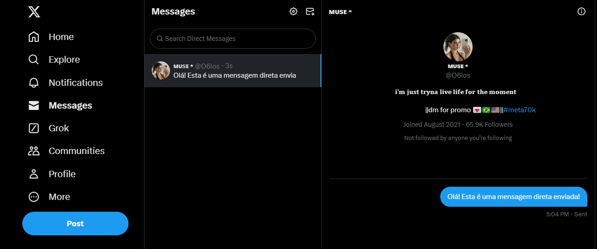

# ENVIANDO MENSAGENS COM TWIT
🚀ESTE BOT TEM COMO FUNCIONALIDADE ENVIAR MENSAGENS DIRETAS AUTOMATIZADAS PARA USUÁRIOS ESPECÍFICOS NO TWITTER.

 <br>

## DESCRIÇÃO:
Este bot desenvolvido em JavaScript com a biblioteca Twit tem como principal funcionalidade enviar mensagens diretas automatizadas para usuários específicos no Twitter. Ele pode ser configurado para enviar mensagens diretas personalizadas para qualquer usuário do Twitter especificado pelo nome de usuário.

## FUNCIONAMENTO:
- O bot autentica-se no Twitter usando as credenciais fornecidas.
- Verifica a autenticação para garantir que as credenciais estejam corretas.
- Carrega o arquivo `MENSAGEM.json` para obter o nome de usuário do destinatário e o texto da mensagem.
- Envia a mensagem direta para o usuário especificado.
- Exibe mensagens de sucesso ou erros conforme necessário.

## EXECUTANDO O PROJETO:
1. **Autenticação como Desenvolvedor:**
   - Acesse o [Twitter Developer Portal](https://developer.twitter.com/) e inscreva-se para uma conta de desenvolvedor.
   - Crie um novo projeto e, dentro deste projeto, crie um novo aplicativo. O Twitter fornecerá as chaves e tokens de acesso necessários: Consumer_key, Consumer_secret, Access Token, e Access Token Secret.
   - Edite o arquivo `./CODIGO/.env` com suas credenciais:
     ```plaintext
      consumer_key=API_KEY
      consumer_secret=API_SECRET
      access_token=ACCESS_TOKEN
      access_token_secret=ACCESS_TOKEN_SECRET
     ```

2. **Instalando as Depêndencias:**
   - Para instalar as dependências listadas no arquivo "package.json", você pode usar o comando `npm install` no terminal. Certifique-se de estar no diretório do seu projeto onde o arquivo "package.json" está localizado (`CODIGO`). O npm irá ler o arquivo "package.json" e instalar todas as dependências listadas nele. 

   ```bash
   npm install
   ```

3. **Editando o `MENSAGEM.json`:**
   - O arquivo `./CODIGO/MENSAGEM.json` deve ter a seguinte estrutura:

   ```json
   {
      "recipient_screen_name": "username_destinatario",
      "message_text": "Olá! Esta é uma mensagem direta enviada pelo meu bot."
   }
   ```

   - Ele precisa ter o nome de usuário do destinatário e o conteúdo da mensagem que deseja enviar.

4. **Inicie o Bot:**
   - Para usar o `NODE`, inicie o bot com o seguinte comando:
    ```bash
    npm start
    ```

    - Para usar o `NODEMON`, inicie o bot com o seguinte comando:
    ```bash
    npm test
    ```

## NÃO SABE?
- Entendemos que para manipular arquivos em muitas linguagens e tecnologias relacionadas, é necessário possuir conhecimento nessas áreas. Para auxiliar nesse aprendizado, oferecemos cursos gratuitos disponíveis:
* [CURSO DE TWIT](https://github.com/VILHALVA/CURSO-DE-TWIT)
* [CURSO DE JAVASCRIPT](https://github.com/VILHALVA/CURSO-DE-JAVASCRIPT)
* [CURSO DE NODEJS](https://github.com/VILHALVA/CURSO-DE-NODEJS)
* [CURSO DE JSON](https://github.com/VILHALVA/CURSO-DE-JSON)
* [CONFIRA MAIS CURSOS](https://github.com/VILHALVA?tab=repositories&q=+topic:CURSO)

## CREDITOS:
- [ADAPTAÇÃO DE "ENVIANDO MENSAGENS COM TWEEPY"](https://github.com/VILHALVA/ENVIANDO-MENSAGENS-COM-TWEEPY)
- [PROJETO FEITO PELO VILHALVA](https://github.com/VILHALVA)

